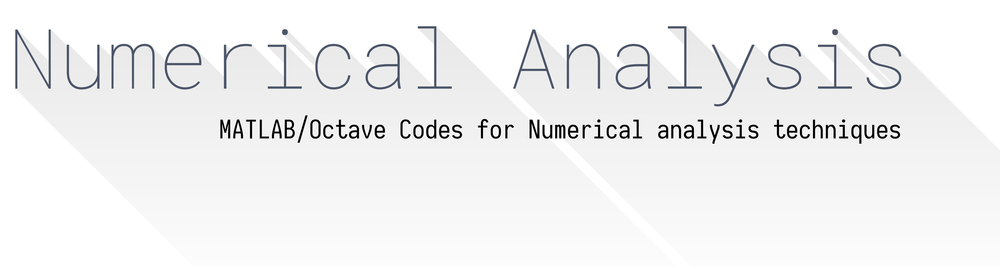

<meta name="google-site-verification" content="t0bH_cniRqsSN85ylxqUtxc1MJhB1riT48a9YEZXHlE" />

   
# Table of Contents

- [Table of Contents](#table-of-contents)
- [Root Finding Methods](#root-finding-methods)
  - [Newton’s method](#newtons-method)
  - [Fixed point method](#fixed-point-method)
  - [Secant method](#secant-method)
- [Interpolation techniques](#interpolation-techniques)
  - [Hermite Interpolation](#hermite-interpolation)
  - [Lagrange Interpolation](#lagrange-interpolation)
  - [Newton’s Interpolation](#newtons-interpolation)
- [Integration methods](#integration-methods)
  - [Euler Method](#euler-method)
  - [Newton–Cotes Method](#newtoncotes-method)
  - [Predictor–Corrector Method](#predictorcorrector-method)
  - [Trapizoidal method](#trapizoidal-method)

# Root Finding Methods

## [Newton&rsquo;s method](https://en.wikipedia.org/wiki/Newton%27s_method)

Newton&rsquo;s method (also known as the Newton–Raphson method) is a method for finding successively better approximations to the roots (or zeroes) of a real-valued function. The process is repeated as 
$$ x_{n+1}=x_{n}-{\frac {f(x_{n})}{f'(x_{n})}} $$

## [Fixed point method](https://en.wikipedia.org/wiki/Fixed-point_iteration)

Fixed-point iteration is a method of computing fixed points of iterated functions. More specifically, given a function f defined on the real numbers with real values and given a point x0 in the domain of f, the fixed point iteration is
$$ x_{n+1}=f(x_{n}),\,n=0,1,2,\dots$$

## [Secant method](https://en.wikipedia.org/wiki/Secant_method)

Secant method is a root-finding algorithm that uses a succession of roots of secant lines to better approximate a root of a function f. The secant method can be thought of as a finite difference approximation of Newton&rsquo;s method.
$$ x_{n}=x_{n-1}-f(x_{n-1}){\frac {x_{n-1}-x_{n-2}}{f(x_{n-1})-f(x_{n-2})}}={\frac {x_{n-2}f(x_{n-1})-x_{n-1}f(x_{n-2})}{f(x_{n-1})-f(x_{n-2})}}. $$

# Interpolation techniques

## Hermite Interpolation

Hermite Interpolation is a method of interpolating data points as a polynomial function. The generated Hermite interpolating polynomial is closely related to the Newton polynomial, in that both are derived from the calculation of divided differences.

## Lagrange Interpolation

Lagrange polynomials are used for polynomial interpolation. See [Wikipedia](https://en.wikipedia.org/wiki/Lagrange_polynomial)

## Newton&rsquo;s Interpolation

Newton&rsquo;s divided differences is an algorithm, historically used for computing tables of logarithms and trigonometric functions. Divided differences is a recursive division process. The method can be used to calculate the coefficients in the interpolation polynomial in the Newton form.

# Integration methods

## Euler Method

Euler method (also called forward Euler method) is a first-order numerical procedure for solving ordinary differential equations (ODEs) with a given initial value. It is the most basic explicit method for numerical integration of ordinary differential equations and is the simplest Runge–Kutta method.
$$ y_{n+1} = y_{n} + h f(t_{n} , y_{n}) $$

## Newton–Cotes Method

Newton–Cotes formulae, also called the Newton–Cotes quadrature rules or simply Newton–Cotes rules, are a group of formulae for numerical integration (also called quadrature) based on evaluating the integrand at equally spaced points. They are named after Isaac Newton and Roger Cotes.

## Predictor–Corrector Method

Predictor–Corrector methods belong to a class of algorithms designed to integrate ordinary differential equations – to find an unknown function that satisfies a given differential equation. All such algorithms proceed in two steps:

1.  The initial, *&ldquo;prediction&rdquo;* step, starts from a function fitted to the function-values and derivative-values at a preceding set of points to extrapolate (&ldquo;anticipate&rdquo;) this function&rsquo;s value at a subsequent, new point.
2.  The next, *&ldquo;corrector&rdquo;* step refines the initial approximation by using the predicted value of the function and another method to interpolate that unknown function&rsquo;s value at the same subsequent point.

## Trapizoidal method

Trapezoidal rule is a technique for approximating the definite integral. The trapezoidal rule works by approximating the region under the graph of the function f(x) as a trapezoid and calculating its area.
$$ \int _{a}^{b}f(x)\,dx\approx \sum _{k=1}^{N}{\frac {f(x_{k-1})+f(x_{k})}{2}}\Delta x_{k}$$

